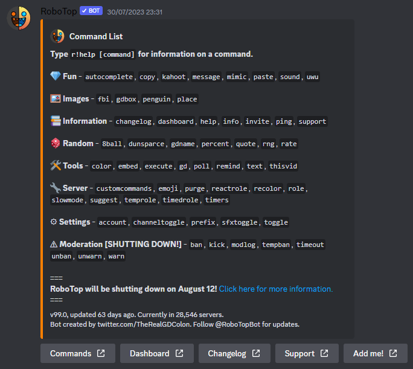
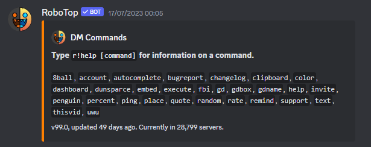

# [RoboTop](https://robotop.xyz) *Clone*

*Originally know as...*
> *A Discord bot by **[GD Colon](https://gdcolon.com)** with all sorts of wacky and uncharacteristic features.*

A clone/remake of **[RoboTop](https://robotop.xyz)**, a bot originally made by **[Colon](https://gdcolon.com)** . I am remaking parts of that bot because of its shutdown on August 12th 2023. RIP RoboTop, You will be missed!

### **Reminders are fully remade, see [RoboBottom Repository](https://github.com/TheCreatorrr333/RoboBottom)**.
Reminders will not be added to this bot, use above bot instead.

# Todo
- [x] in userdb first interaction i.e. profile creation date
- [x] Find the permissions function and get it there idk wherever the fuck it is
- [ ] cleanse() function for removing any potential discord markdown and replacing it with something (optionally!) - add to tcrutils.discord
- [ ] Commands
  - [ ] r!prefix
  - [x] r!help
  - [ ] r!message
- [ ] New commands
  - [ ] r!timestr
- [ ] Rainbow RoboTop logo
- [ ] Robo↑ logo
- [ ] flip the dict to be {execute: ("ex", "x")} then flip it with code again

### Commands (development reference only!!! - not all of them are made already of course)

~~~~
<!-- I am MEGUMIN the greatest mage among crimson demons and wielder of EXPLOSION MAGIC -->
~~~~
~~~~
~~~~
